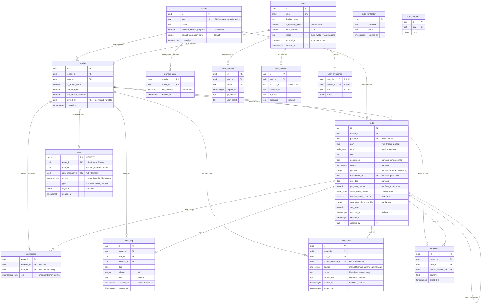

# Lean — Datenbankstruktur (Stand: Migrationen 0001–0028)

Aktuelles Schema der Postgres-Datenbank als Diagramm, jede Tabelle mit
einer echten Beispielzeile aus dem Seed (`db/seed/seed.sql`, Tenant
**forsit** / **nebenwerk**). Quelle der Wahrheit bleiben die SQL-Migrationen
in `db/migrations/`; dieses Dokument ist die lesbare Übersicht.

Zwei Leseregeln vorab:

- **Tenant-Isolation.** Fast jede Domänentabelle trägt `tenant_id`;
  Fremdschlüssel sind **zusammengesetzt `(tenant_id, id)`**, damit
  tenant-übergreifende Verweise gar nicht darstellbar sind (Invariante 1).
- **Event-first.** `event` ist die Historie; alle anderen Domänentabellen
  sind Projektionen, die über `write_event` + SECURITY-DEFINER-Funktionen
  fortgeschrieben werden (Invariante 2). Es gibt kein `updated_at` — der
  Event-Log *ist* die Änderungshistorie (Ausnahme: die better-auth-Tabellen).

## ER-Diagramm

## Enums

| Enum | Werte |
|---|---|
| `node_type` | `area`, `project`, `task` |
| `task_status` | `open`, `in_progress`, `blocked`, `done` |
| `event_source` | `ui`, `teams`, `slack`, `api`, `llm`, `system` |
| `alarm_kind` | `due_soon`, `stagnant` |
| `alarm_state` | `none`, `blocked_below`, `stagnant`, `due_soon`, `overdue` (Eskalationsreihenfolge; `blocked_below` ungenutzt) |
| `membership_role` | `member`, `branch_admin` |
| `info_source` | `manual`, `teams`, `slack`, `llm_summary`, `api` |

## Beispielzeilen (aus dem Seed)

### tenant
| id | slug | name | skeleton_shows_progress | default_stagnation_days |
|---|---|---|---|---|
| `1111…1111` | `forsit` | Forsit | true | 7 |
| `2222…2222` | `nebenwerk` | Nebenwerk GmbH | true | 7 |

### user
| id | email | display_name | is_instance_admin |
|---|---|---|---|
| `e0…0001` | mpiksa@forsit.de | Matthias B. | false |
| `e0…0006` | admin@lean.forsit.de | Instance Admin | **true** (keine Memberships → kein Datenzugriff, Invariante 6) |

### member
| id | tenant_id | user_id | is_tenant_admin | has_hr_rights | can_create_branches |
|---|---|---|---|---|---|
| `ae…0001` | forsit | Matthias B. | true | true | true |
| `ae…0005` | forsit | Jonas T. | false | false | **false** (bewusst ohne Zweig-Anlage) |
| `be…0001` | nebenwerk | Matthias B. | true | true | true (**derselbe User, zweite member-Zeile**) |

### node — Zweig (branch)
| id | type | title | parent_id | progress_cached | alarm_state_cached |
|---|---|---|---|---|---|
| `a1…0001` | area | Forsit Holding | — (Wurzel) | 58 | overdue |
| `a1…0002` | area | myWell | Forsit Holding | 62 | overdue |
| `a1…0007` | area | Neuland Ventures | Forsit Holding | **NULL** (leer → rendert „—") | none |

### node — Aufgabe (task): der Beispielknoten **t1**
| Feld | Wert |
|---|---|
| id | `a2000000-0000-4000-8000-000000000001` |
| type | `task` |
| title | Zahlungsanbieter-Integration abschließen (Stripe → Mollie) |
| description | Wechsel des Zahlungsanbieters von Stripe zu Mollie für den EU-Markt … |
| status | **blocked** |
| percent | 60 |
| responsible_id | `ae…0002` (Igor K. — genau eine Person, Invariante 4) |
| due_date | 2026-07-17 |
| alarm_state_cached | **due_soon** (§15.3-Korrektur: Fälligkeitsalarm bleibt trotz `blocked` sichtbar) |
| parent_id | `a1…0002` (myWell) |

### membership (nur auf Zweige, nach unten vererbt)
| tenant_id | member_id | node_id | role |
|---|---|---|---|
| forsit | Matthias B. | Forsit Holding (Wurzel) | **branch_admin** (ganzer Baum) |
| forsit | Aylin D. | myWell | member |
| forsit | Aylin D. | Forsit Beratung | member (bewusst partiell → Skelett-Vorfahren testbar) |

### time_log
| id | task_id | member_id | date | minutes | note |
|---|---|---|---|---|---|
| `dd…0001` | t1 | Igor K. | heute − 1 | 120 | Webhook-Debugging |
| (auto) | t1 | Igor K. | heute − 4 | 240 | Checkout-Flow umgebaut |

t1 summiert im Seed **14 h 45 m** — Eingabe für die gewichtete Rollup-Berechnung (M3).

### info_piece (append-only, Quelle getaggt)
| task_id | author_member_id | source | content (gekürzt) |
|---|---|---|---|
| t1 | Matthias B. | `manual` | Vertrag mit Mollie ist unterschrieben … |
| t1 | Igor K. | `teams` | Webhook-Signaturprüfung schlägt fehl — Ticket #88231 … |
| t1 | **NULL** | `llm_summary` | Zusammenfassung des Threads (12 Nachrichten) … (maschinell, Invariante 7) |

### comment
| task_id | author_member_id | content (gekürzt) |
|---|---|---|
| t1 | Marlene S. | Sollten wir den Release-Termin trotzdem halten? … |
| t1 | Igor K. | Halte ich für riskant, solange #88231 offen ist … |

### event (Historie — Projektionen entstehen hieraus)
| tenant_id | node_id | actor | source | type | payload |
|---|---|---|---|---|---|
| **NULL** | NULL | NULL | system | `tenant.created` | `{"slug":"forsit","actor_user_id":"e0…0006"}` (Instanz-Ebene) |
| forsit | t1 | Igor K. | ui | `task.percent_changed` | `{"old":40,"new":60}` |
| forsit | t1 | Igor K. | ui | `task.status_changed` | `{"old":"in_progress","new":"blocked"}` |
| forsit | t1 | — | teams | `info.added` | `{"info_piece_id":"…","source":"teams"}` |

### domain_claim
| domain | tenant_id | sso_enforced |
|---|---|---|
| `entra-only.example` | forsit | **true** (erzwingt SSO, deaktiviert OTP für die Domain) |

### user_preference (UI-Zustand, kein Event)
| user_id | tenant_id | key | value |
|---|---|---|---|
| Matthias B. | forsit | `glance.cardSize` | `{"…":"…"}` (z. B. Kachelgrößen der Glance-Ansicht) |

### auth_* (better-auth, eigene Rolle `auth_user`)
`auth_session`, `auth_account`, `auth_verification`, `auth_rate_limit`
werden von better-auth befüllt (OTP, OIDC/Entra, Sessions, Rate-Limits) und
sind nicht Teil der Seed-Domänendaten. Sie verweisen auf `"user"`, erreichen
aber **keine** Tenant-Daten (Invariante: Auth-Pfad ist tenant-blind).

## Sichten & abgeleitete Strukturen (keine Tabellen)

| Objekt | Migration | Zweck |
|---|---|---|
| `visible_nodes` | 0017/0020/0026 | Spalten-maskierende Lesesicht: volle Sicht im Membership-Subtree, Skelett-Vorfahren nur mit Titel (§5). |
| `task_time_totals` | 0017/0026 | Aufgaben-Zeitsummen für alle mit Task-Sicht. |
| `last_progress_at` | 0017 | Letzter Fortschritt je Knoten (Stagnations-Alarm, M5). |
| `search_visible(p_query)` | 0023 | Deutsche Volltextsuche (FTS) über sichtbare Knoten/Infos/Kommentare, SECURITY INVOKER. |
| `evaluate_alarms(p_now)` | 0021 | Alarm-Pass (Worker, alle 30 min): setzt `alarm_state_cached` / `blocked_below_cached`. |
| Rollup-Trigger | 0018/0026 | Fortschreibung von `progress_cached` entlang der ltree-Vorfahren beim Schreiben, gewichtet nach gebuchten Minuten (Invariante 8). |
